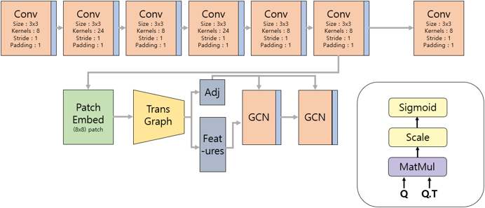

# Graph Convolution Networks for Floor-Plan Segmentation with Multi-GPUs

Implementation of GCN-CAD model, a simple way to achieve line segmentation tasks(e.g. crack detection, floor-plan segmentation...) in pytorch.

This model was studied to remodel architectural drawings expressed in different formats into one normalized standard layer according to the way architectural designers work.

Existing segmentation models have been developed into dense prediction or IoU-based loss, but show unsuitable performance in the architectural drawing domain with thin lines of 1-5px units.

After dividing the input drawing into patches, we propose a graph segment model by using each patch as a graph node.

</img>
